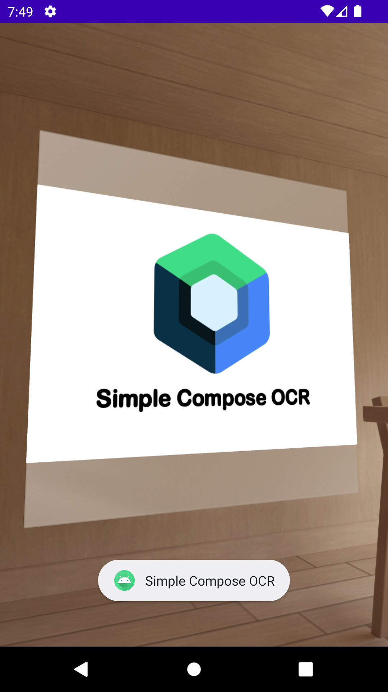

# Simple Barcode Scanner and OCR App in Compose

- Permissionhandling with Google Accompanist
- Barcode recognition and text recognition with ML Kit

For simplicity without navigation or proper architecture

